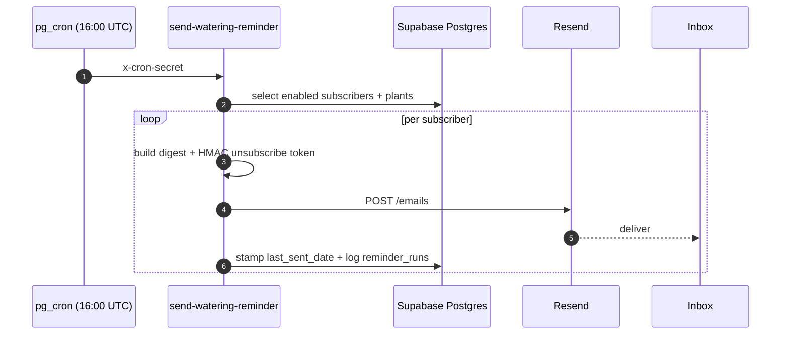

<a name="readme-top"></a>

<p align="center">
  
</p>

<h1 align="center">Sill</h1>

<p align="center"><i>Sillus domesticus</i> — a windowsill that emails you.</p>

<p align="center">
  <a href="https://pleasepleasepleasewater.me">Live</a> ·
  <a href="#vital-stats">Stats</a> ·
  <a href="#light">Light</a> ·
  <a href="#water">Water</a> ·
  <a href="#soil">Soil</a> ·
  <a href="#symptoms--remedies">Symptoms</a> ·
  <a href="#propagation">Propagation</a> ·
  <a href="./CLAUDE.md">Docs</a>
</p>

---

A small plant-watering tracker that lives at **pleasepleasepleasewater.me**. The owner curates the collection — adding, editing, watering, and deleting are owner-only, gated by a password on `/owner`. Everyone else can browse the collection, export it, and subscribe an email for a daily digest of what's thirsty.

> The domain reads the way the plants would say it.

> [!NOTE]
> **Plant edits are owner-only.** The owner unlocks a device at `/owner` by pasting a shared password (validated server-side via the `verify_owner_key` RPC, persisted in `localStorage.sill.owner`). Non-owners see a read-only UI — no Add / Water / Edit / Delete buttons, and `/plants/new` and `/plants/:id/edit` redirect away. The subscriber list is also locked down — emails are private.

<p align="right"><a href="#readme-top">back to top ↑</a></p>

## Vital stats

<table>
  <tr><td><b>Origin</b></td><td>Vercel (SPA), Supabase (data + cron), Resend (email)</td></tr>
  <tr><td><b>Habitat</b></td><td>Postgres + Edge Functions + <code>pg_cron</code> + <code>pg_net</code></td></tr>
  <tr><td><b>Foliage</b></td><td>React 18 · Vite 5 · TypeScript · React Router v6</td></tr>
  <tr><td><b>Watering</b></td><td>Daily 9am Pacific (drifts to 8am in winter — cron is UTC and doesn't honor DST)</td></tr>
  <tr><td><b>Hardiness</b></td><td>Free-tier Supabase · 100 emails/day Resend · zero CSS frameworks</td></tr>
  <tr><td><b>Propagation</b></td><td><code>git clone && npm install && npm run dev</code></td></tr>
</table>

<p align="right"><a href="#readme-top">back to top ↑</a></p>

## Light

What Sill asks of a contributor:

- **Inline styles.** No CSS framework, no UI library. One stylesheet at `src/index.css` for keyframes, scrollbar, focus rings, and the single `@media (max-width: 720px)` mobile breakpoint.
- **Design tokens are the source of truth.** Reach for `src/lib/tokens.ts` — `colors.surface.DEFAULT`, `colors.brand.DEFAULT`, `type.body.fontFamily` — never hard-code `'Newsreader'` or a hex code.
- **Read [`CLAUDE.md`](./CLAUDE.md) first.** It carries the architectural memory (privacy enforcement, secret rotation, the things that have bitten us). This README is the porch; CLAUDE.md is the workshop.

<p align="right"><a href="#readme-top">back to top ↑</a></p>

## Water

Once a day, every subscriber gets a digest. Three single-purpose Edge Functions, stitched together by one shared HMAC token.



The unsubscribe link in every email is `subscriberId.base64url(HMAC-SHA256(secret, "id:email"))`. Same construction in all three Edge Functions and a SQL mirror. **One-click unsubscribe is JSON-only** — Supabase's gateway forces `content-type: text/plain` on unauthenticated functions, so the visible landing page lives at `/unsubscribed` inside the SPA. Email clients (Gmail, Apple Mail) hit `/api/unsubscribe` via a `vercel.json` rewrite; the SPA hits the same endpoint with a JSON body.

<p align="right"><a href="#readme-top">back to top ↑</a></p>

## Soil

Three tables in `public`. The soil is shallow on purpose.

```text
┌────────────────────┐     ┌────────────────────┐     ┌────────────────────┐
│  plants            │     │  subscribers       │     │  reminder_runs     │
│  ──────────        │     │  ──────────        │     │  ──────────        │
│  read: open        │     │  RLS-locked        │     │  audit log         │
│  write: owner-only │     │  no anon SELECT    │     │  one row per send  │
│  via plant_upsert  │     │  in: subscribe()   │     │  fuels heartbeat   │
│  /plant_remove RPC │     │  out: count() RPC  │     │  banner            │
└────────────────────┘     └────────────────────┘     └────────────────────┘
```

> [!NOTE]
> Privacy is enforced at three layers because each one has slipped before — (1) RLS denies anon SELECT on `subscribers`, (2) the Subscribe page never reads from `subscribers` on mount, (3) a Playwright spec greps the production JS bundle for `@` and fails on a match. If you change `src/screens/Subscribe.tsx`, re-run `npm run test:e2e -- privacy.spec.ts`.

<p align="right"><a href="#readme-top">back to top ↑</a></p>

## Feeding schedule

| Script | What it does |
|---|---|
| `npm run dev` | Vite dev server on `:5173` |
| `npm run build` | `tsc -b && vite build` → `dist/` |
| `npm run preview` | Serve the built bundle locally |
| `npm run typecheck` | `tsc -b --noEmit` — no JS emitted |
| `npm run test:e2e` | Playwright suite (needs `.env.test.local`) |

> [!NOTE]
> `npm run typecheck && npm run build` must be clean before shipping.

<p align="right"><a href="#readme-top">back to top ↑</a></p>

## Palette

The audit-locked palette, shared by app and email. Status colors are the same ramp you'll see on the dashboard sprites.

<p>
  
  
  
  
  
</p>

Forest is the CTA. Cream is the page. Sage means happy. Amber means due soon. Burnt orange means overdue and a little wilted (a CSS filter actually tilts the sprite when a plant is late).

<p align="right"><a href="#readme-top">back to top ↑</a></p>

## Symptoms & remedies

The papercuts each have a fix. They're documented because they all bit at least once.

<table>
  <tr>
    <td width="40%"><b>Symptom</b></td>
    <td><b>Remedy</b></td>
  </tr>
  <tr>
    <td>Leaves drooping — no email arrived, yellow banner up</td>
    <td>Supabase free tier auto-paused the project. <code>select * from reminder_runs order by ran_at desc limit 5</code> and <code>select * from cron.job_run_details order by start_time desc limit 5</code>. Resume the project; the banner clears on the next successful run.</td>
  </tr>
  <tr>
    <td>Reminder arrived an hour early in November</td>
    <td><code>pg_cron</code> runs in UTC and doesn't honor DST. 9am PDT becomes 8am PST every winter. Accepted tradeoff — do not "fix."</td>
  </tr>
  <tr>
    <td>Unsubscribe page shows raw HTML source</td>
    <td>Supabase's gateway forces <code>content-type: text/plain</code> on unauthenticated Edge Functions. The visible page must live at <code>/unsubscribed</code> in the SPA; the Edge Function returns JSON only.</td>
  </tr>
  <tr>
    <td>The icon PNG has speckles on the dark-green tile</td>
    <td>Non-integer SVG-to-PNG scaling. <code>public/icon-email.png</code> must be rendered at exactly 288×288 (16× the 18-unit SVG). 256 sounds reasonable, is 14.22×, dithers. See CLAUDE.md → Sender icon for the ImageMagick incantation.</td>
  </tr>
  <tr>
    <td>An email link says "invalid token" the day after a secret rotation</td>
    <td><code>UNSUBSCRIBE_SECRET</code> lives in two places. Update <i>both</i>: <code>supabase secrets set UNSUBSCRIBE_SECRET=…</code> AND <code>update private.app_secrets set unsubscribe_secret = …</code>. Otherwise pre-rotation links stop verifying.</td>
  </tr>
</table>

<p align="right"><a href="#readme-top">back to top ↑</a></p>

## Propagation

```bash
git clone https://github.com/randyren278/sill.git
cd sill
cp .env.local.example .env.local
# Fill VITE_SUPABASE_URL and VITE_SUPABASE_ANON_KEY from the Supabase dashboard.
npm install
npm run dev          # http://localhost:5173
```

<details>
<summary><kbd>Full environment variable reference</kbd></summary>

**`.env.local` (frontend, ships to the client):**

- `VITE_SUPABASE_URL` — Supabase project URL
- `VITE_SUPABASE_ANON_KEY` — publishable `sb_publishable_…` key (safe to ship)
- `VITE_IMPORT_SECRET` — gates the import-backup Edge Function

**Do not** add `VITE_WELCOME_SECRET`. The welcome secret is server-side only — the `subscribe()` RPC fires welcome emails via `pg_net` from Postgres, reading the secret out of `private.app_secrets`. Anything with a `VITE_` prefix is grep-able in the production JS bundle.

**Supabase Edge Function secrets (server-side):**

- `RESEND_API_KEY`
- `CRON_SHARED_SECRET` (also embedded literally inside the `cron.schedule` SQL)
- `UNSUBSCRIBE_SECRET` (also mirrored into `private.app_secrets.unsubscribe_secret`)
- `WELCOME_SHARED_SECRET` (also mirrored into `private.app_secrets.welcome_shared_secret`)
- `IMPORT_SHARED_SECRET`
- `REMINDER_SENDER` — e.g. `Sill <reminders@pleasepleasepleasewater.me>`
- `APP_URL` — `https://pleasepleasepleasewater.me`

**`.env.test.local` (Playwright; never commit):**

- `SUPABASE_SERVICE_ROLE_KEY`
- `CRON_SHARED_SECRET`

See `.env.test.local.example` for the full template.

</details>

<details>
<summary><kbd>A field note about commits</kbd></summary>

There is a pre-existing typo (`WLsCo` where it should be `WLsC`) in `.env.local.example` that keeps trying to sneak into commits. Don't `git add .` — review every file. Also: don't commit `tsconfig.app.tsbuildinfo`.

</details>

<p align="right"><a href="#readme-top">back to top ↑</a></p>

## What this plant is NOT

If a feature request seems to require any of these, raise it first — the answer might be _"we don't do that here."_

- Not multi-tenant. One plant collection, shared by all visitors.
- No accounts, no login screen. Plant edits are gated by a single shared password the owner pastes on `/owner` (stored in `localStorage`, validated by the `verify_owner_key` RPC). That's the entire auth story — intentional.
- No manage-my-subscription page. Subscribe and unsubscribe are the entire surface.
- No double opt-in. Single opt-in is fine for this trust model.
- No GitHub Actions CI. Playwright is local-only for now.

<p align="right"><a href="#readme-top">back to top ↑</a></p>

## Field notes

- Pixel-art sprites are hand-authored in [`src/lib/sprites.ts`](src/lib/sprites.ts) — six archetypes (broad, cane, trail, succ, fan, bush), four green palettes, all 18×18 with `shape-rendering: crispEdges`. They sway when they mount and wilt when they're overdue.
- The favicon you see at the top of this file is the same pixel-art, scaled 10× from `viewBox="0 0 18 18"`.
- Design tokens live in [`src/lib/tokens.ts`](src/lib/tokens.ts); email-template palette is mirrored separately and audit-locked in [`CLAUDE.md`](./CLAUDE.md#email-design-palette-locked-audit-passed).
- Built on the shoulders of [Supabase], [Resend], and [Vercel].

<p align="right"><a href="#readme-top">back to top ↑</a></p>

[Supabase]: https://supabase.com
[Resend]: https://resend.com
[Vercel]: https://vercel.com
